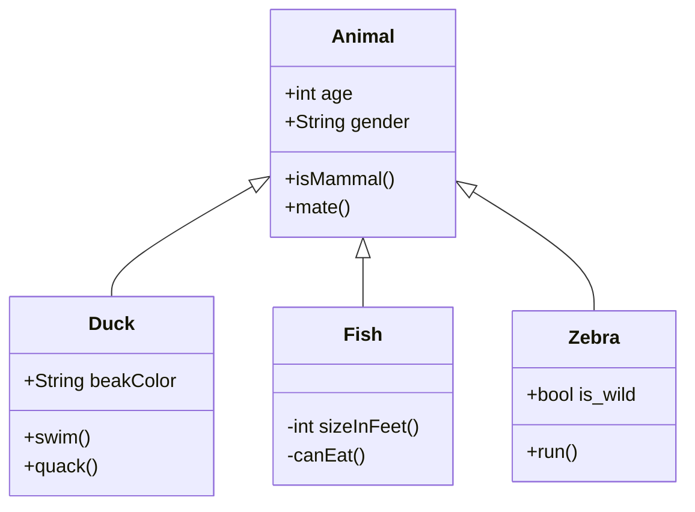

# Mermaid Practice File 2

Another practice using Mermaid/Markdown for first time.
In this time, it will create a Entity class diagram

```mermaid
    classDiagram
        Animal <|-- Duck 
        Animal <|-- Fish
        Animal <|-- Zebra
        Animal : +int age
        Animal : +String gender
        Animal : +isMammal()
        Animal : +mate()
        class Duck{
            +String beakColor
            +swim()
            +quack()
        }
        class Fish{
            -int sizeInFeet()
            -canEat()
        }
        class Zebra{
            +bool is_wild
            +run()
        }
```