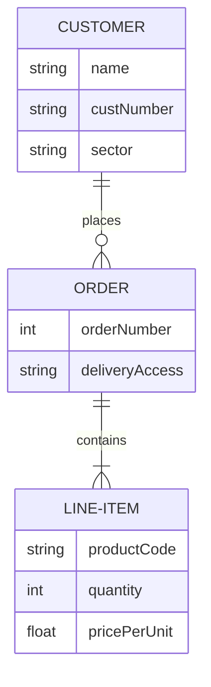

# Mermaid Practice File 3

In this file, I will create a Entity Relationship Diagram (E/R) of a customer

```mermaid
    erDiagram        
        CUSTOMER {
            string name 
            string custNumber
            string sector
        }
        CUSTOMER ||--o{ ORDER: places

        ORDER {
            int orderNumber
            string deliveryAccess
        }
        ORDER ||--|{ LINE-ITEM: contains

        LINE-ITEM {
            string productCode
            int quantity
            float pricePerUnit
        }
```